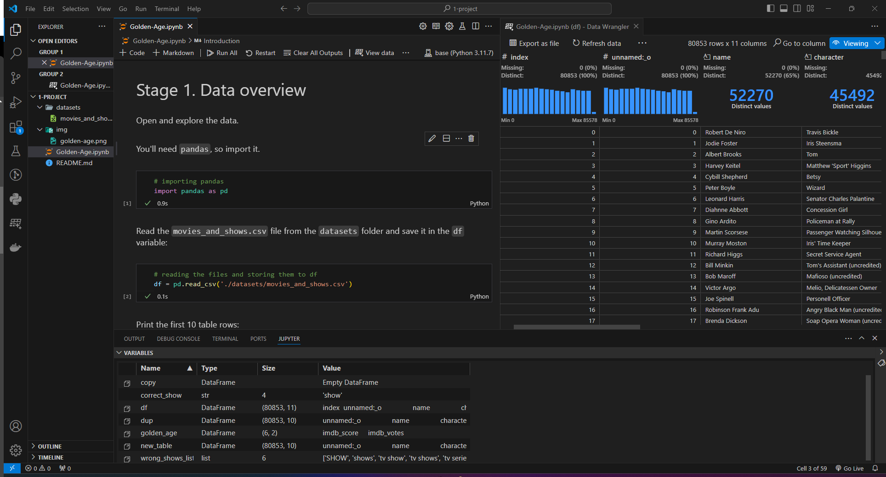

# TripleTen Projects

<!-- personal notes
open markdown to the side: crt + k  v 
Activate your environment: .venv\Scripts\Activate.ps1
-->

## About Me

I'm currently undergoing an intensive data science bootcamp with TripleTen, where I'm honing my skills in Python programming, data analysis, machine learning, and more. Through this portfolio, I aim to demonstrate my growth and expertise in the field while sharing my personal approach to analytical challenges.

## Repository Structure

- **Project1:** Tasked to analyze a dataset of movies and shows with Python and Pandas to showcase the highly rated programs from the Golden Age of television.
- **Project2:** The task entails analyzing a modified Instacart dataset for insights into customer shopping habits, involving data cleaning, and addressing key questions.
- **Project3:** Tasked to analyze 2018 data from 500 clients to determine whether the Surf or Ultimate prepaid plan generates more revenue, aiming to adjust the advertising budget accordingly.
- **Project4:** The task involves performing a basic data analysis of Netflix to familiarize myself with `Streamlit` and the utilization of custom `modules`.

## Deployment

This project was completed using the `Visual Studio Code` editor. I utilized `Anaconda Individual Edition` with all standard settings. To ensure compatibility, I installed the `ipykernel` package using `Anaconda Navigator`. Additionally, I downloaded the following extensions for `Visual Studio Code`: `Python` from `Microsoft`.

For your convenience, I have the **Jupyter Notebook** directly connected to a **Google Colab**. You can simply click on the **Google Colab** link to access and test each **Jupyter Notebook**. You can find the link in the upper left corner.

**Note:** When using `Google Colab`, make sure to take note of the instructions and change the value for the import.

### Deployment Resources

The following links are videos you can watch if my project piques your interest and you want to try any of this for yourself.

- This is for a [basic deployment.](https://www.youtube.com/watch?v=DA6ZAHBPF1U)
- This one is for a more [advanced deployment.](https://www.youtube.com/watch?v=zulGMYg0v6U)

## Improvement

Any and all improvements will be displayed here as new methods and insights are discovered.

5/4
I gained a better understanding of Git, GitHub, and how repositories work. In my previous attempt at adding an interactive link, it resulted in a branch that did not merge correctly when I attempted a commit. Now, I understand the importance of checking the status of the GitHub repository and ensuring to fetch for any changes so that there are no conflicting files or unnecessary branches.

5/13
I added a plain test file that can be adapted to any programming language for experimenting with different code instances outside my projects.

5/19
I have also deepened my understanding of Python. My code can now run seamlessly without needing to input different variables when loading CSV files, and the entire program can be executed in any environment, as long as the Internet is available.

## Feedback

I'm always eager to improve and welcome any feedback or suggestions you may have. Feel free to reach out to me via [email](mailto:alexcoy06@gmail.com), [LinkedIn](https://www.linkedin.com/in/alexander-coy/), or [GitHub](https://github.com/alexcoy06) to share your thoughts.

### Connect with Me

LinkedIn: [alexander-coy](https://www.linkedin.com/in/alexander-coy/)  
GitHub: [alexcoy06](https://github.com/alexcoy06)  
Email: [alexcoy06@gmail.com](mailto:alexcoy06@gmail.com)

Thank you for visiting my portfolio! I hope you find my projects insightful and engaging.
